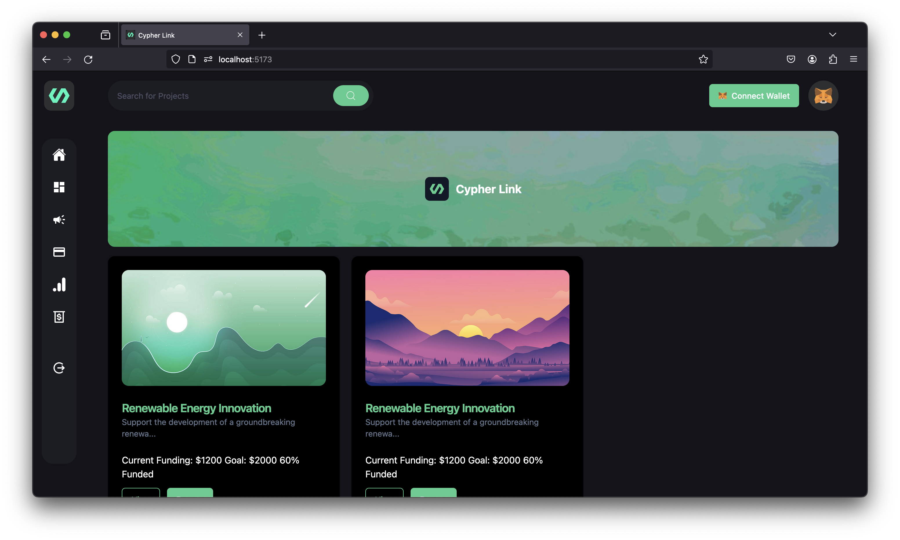
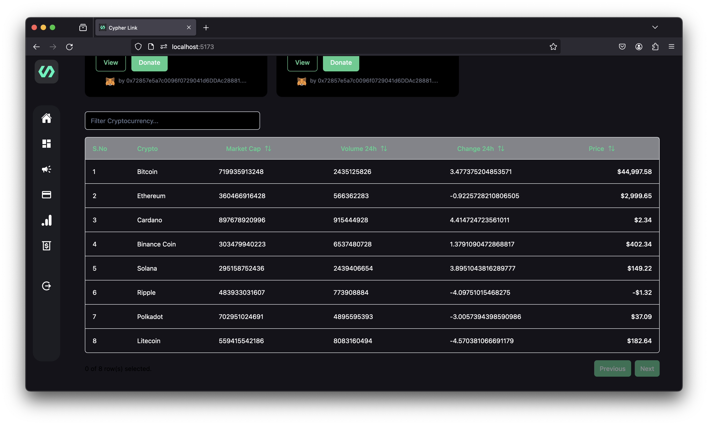
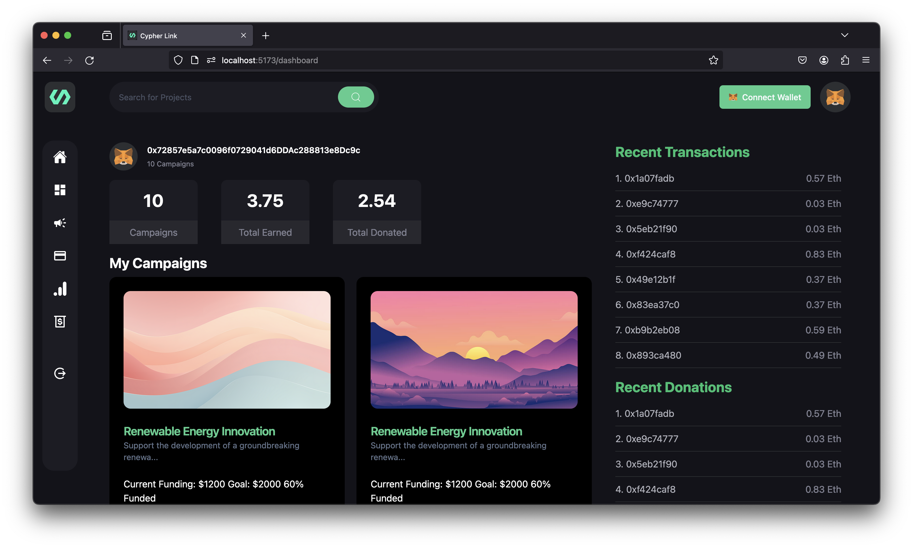
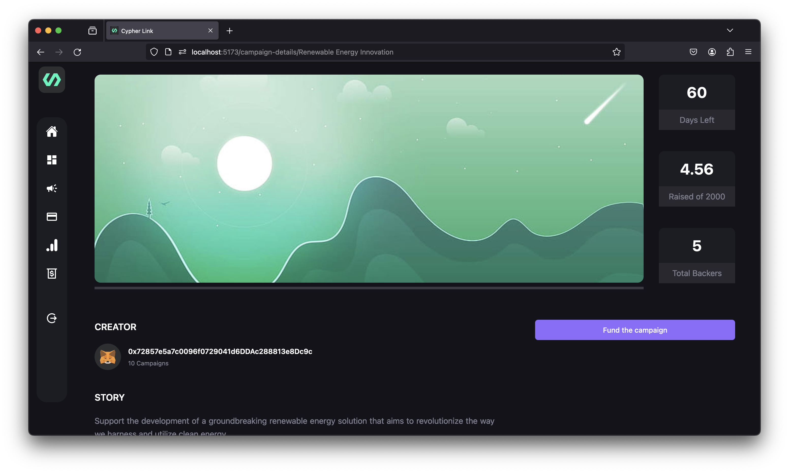
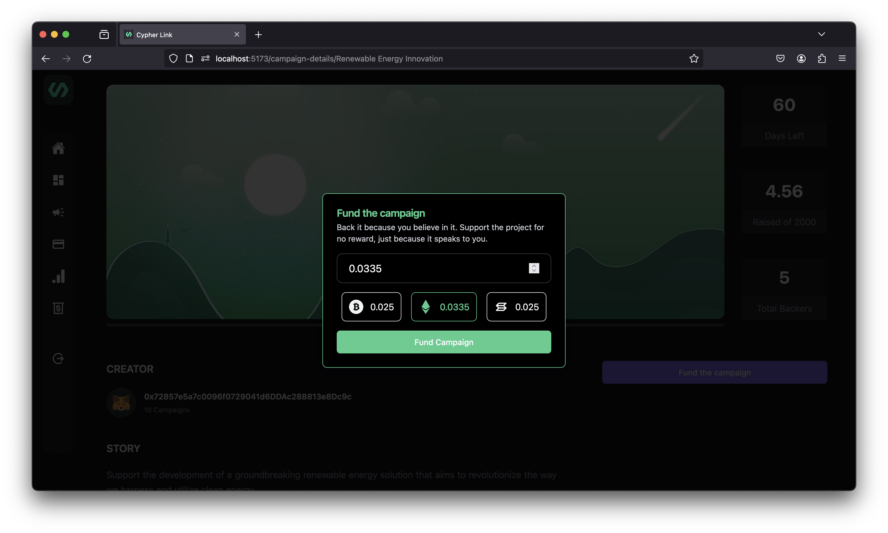

# Cypher Link

Cypher Link is a decentralized crowdfunding platform designed to empower indie developers by facilitating transparent and cross-chain funding transactions. Built using ThirdWeb SDK, ReactJS, Ethers, and TypeScript, Cypher Link aims to revolutionize the way developers connect with supporters and receive funding for their projects through the use of cryptocurrency.

## Features

- **Metamask Integration:** Seamless integration with Metamask allows developers to create and manage campaigns using their Metamask ID.
- **Cross-Chain Transactions:** Cypher Link supports cross-chain transactions, providing users with the flexibility to choose their preferred chainnet for both donations and receipts.
- **Transparent Crowdfunding:** The platform provides a transparent and accessible crowdfunding ecosystem, where developers can showcase their projects and explain their impact to attract potential donors.

## Technologies Used

- ThirdWeb SDK
- ReactJS
- Ethers
- TypeScript

## Usage

1. Connect your Metamask wallet.
2. Create a campaign by providing details about your project.
3. Choose your preferred chainnet for both donations and receipts.
4. Share your campaign and start receiving funds from supporters.

## Challenges Faced:
1. **Technical Complexity**: Navigating intricate aspects of cross-chain transactions and **ThirdWeb SDK** integration requires advanced blockchain expertise.

2. **Security Concerns**: Ensuring robust security for crypto transactions, user wallets, and smart contracts is pivotal for trust and platform integrity.

3. **Metamask Integration**: Seamless integration with **Metamask** across diverse blockchain networks adds complexity to wallet functionality.

4. **User Adoption**: Convincing indie developers to embrace decentralized crowdfunding demands a clear value proposition and an intuitive user experience.

5. **Scalability Challenge**: Scaling the platform to handle a growing user base and increased transactions is essential for sustained success.

## Watch Me

[YouTube Link](link)

## Images of the Project

